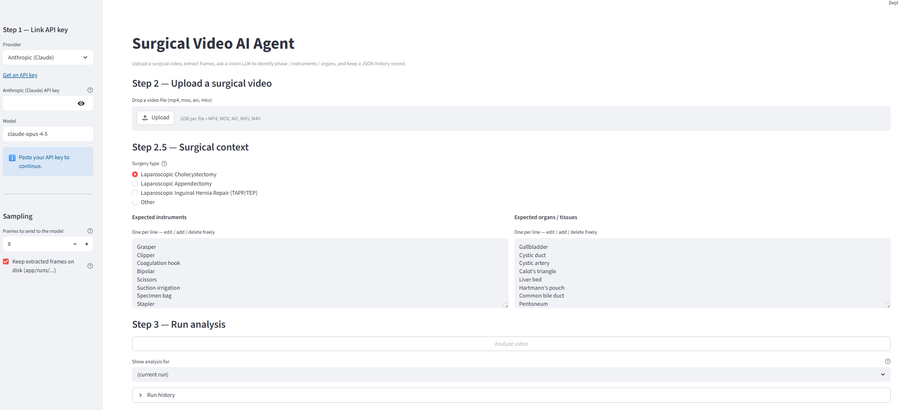
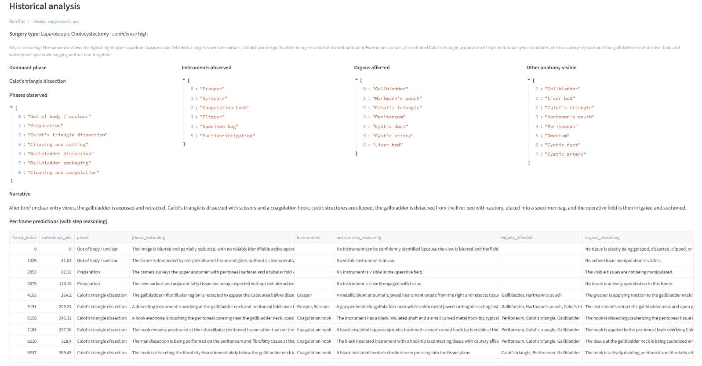
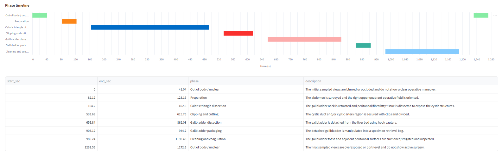
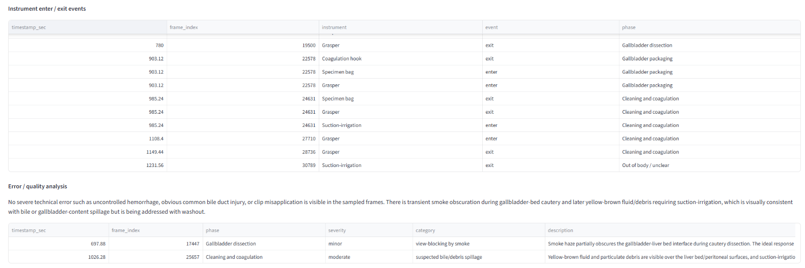

# DEXLab Surgical Video Agent

A Streamlit-based agent that takes a laparoscopic / endoscopic surgery clip and uses a vision LLM (Anthropic Claude, OpenAI GPT, or Google Gemini) to identify:

- **Surgery type** — from a small catalog (Cholecystectomy / Appendectomy / Inguinal Hernia Repair) or free-form
- **Surgical phase** per frame, with reasoning
- **Instruments** in use, with reasoning
- **Organs / tissues** being operated on, with reasoning
- **Phase timeline** across the clip
- **Instrument enter / exit events**
- **Error / quality analysis** (incidents flagged with severity)

Every run is saved as a JSON record under `app/runs/` and indexed in `app/history/`.

## System Overview

### 1. Main UI — three steps in one page
Sidebar (left) holds the **provider / API key / model** picker and the **number of frame-to-send** input. The main panel walks through three steps: upload a video, confirm the **surgery type** and edit the expected **instruments / organs** vocabulary (one per line, freely editable), then click **Analyze video**. The bottom **Show analysis for** selector and **Run history** expander let you replay any past run in place.



### 2. Historical analysis — full recap of a past run
Selecting a past run from the dropdown re-renders the whole result in place: identified **surgery type** with Step-1 reasoning, the four-column **summary** (dominant phase, phases observed, instruments observed, organs affected, anatomy visible), the **narrative paragraph**, and the full **per-frame predictions table** with phase / instruments / organs reasoning columns. This is the place to inspect what the model actually saw and why it called each frame the way it did.



### 3. Phase timeline
After analysis the per-frame phase labels are aggregated into a **Gantt-style timeline** showing when each surgical phase begins and ends within the clip. Below the chart is a table of phase segments (`start_sec`, `end_sec`, `phase`, `description`) so you can read off the boundaries exactly.



### 4. Instrument events + error / quality analysis
Two analytical layers on top of the per-frame predictions: **Instrument enter / exit events** (each row marks a tool entering or leaving the field, with the active phase) gives a temporal trace of tool usage; **Error / quality analysis** is the model's structured note on suboptimal moments: a `summary` plus a table of incidents with `severity`, `category`, and a 2-3 sentence description of what happened vs what should have happened.



## Quick start

```bash
pip install -r app/requirements.txt
streamlit run app/main.py
```

Open the URL Streamlit prints (default <http://localhost:8501>) and:

1. Sidebar → paste an API key for one of the three providers
2. Step 2 → upload a surgery clip (mp4 / mov / avi / mkv, ≤ 2 GB)
3. Step 2.5 → confirm the surgery type and edit the instrument / organ vocabulary
4. Step 3 → click **Analyze video**

Results render below: surgery type, per-frame predictions table, phase timeline (Gantt), instrument-event table, and the error analysis. The full JSON is downloadable.

## What the AI sees

Each run extracts N evenly-spaced frames from the video and sends them as JPEG-encoded base64 attachments. The exact bytes that go to the model are saved on disk under `app/runs/<run_id>/frames_sent/` so you can audit what the model actually saw.

For Gemini, there is also a "Send the FULL video" toggle that uploads via the Files API and lets the model sample frames internally (~1 fps) — Anthropic and OpenAI APIs do not accept video files directly.

## Module layout

| File | Role |
| --- | --- |
| [`app/main.py`](app/main.py) | Streamlit UI |
| [`app/pipeline.py`](app/pipeline.py) | Orchestrator: probe → extract → analyze → save record |
| [`app/video_utils.py`](app/video_utils.py) | Frame sampler (OpenCV); decodes once, caches API-ready JPEG bytes |
| [`app/ai_clients.py`](app/ai_clients.py) | Pluggable Anthropic / OpenAI / Gemini clients + the system prompt and surgery catalog |
| [`app/history.py`](app/history.py) | Per-run JSON files + rolling history index |

## Key design choices

- **Three-step reasoning** in the prompt: surgery type → phase → instruments/organs, each with explicit `reasoning` fields per frame.
- **User-supplied context** is injected as a "treat as ground truth" hint block; the user can pre-confirm surgery type, expected instruments, and expected anatomy.
- **Extended thinking** is enabled by default for Claude (8000-token thinking budget) so the model deliberates before emitting JSON.
- **Streaming** is used for Anthropic to dodge the SDK's 10-minute non-streaming guard when `max_tokens` is high.
- **Frames are JPEG-encoded ONCE** at decode time and cached on the `Frame` object — `to_base64()` reads the cache, no disk round-trip.

## Notes

- API keys are kept in Streamlit `session_state` only; they are not written to disk. You can also pre-set `ANTHROPIC_API_KEY`, `OPENAI_API_KEY`, or `GOOGLE_API_KEY` in the environment.
- Streamlit's upload limit is bumped to 2 GB via [`.streamlit/config.toml`](.streamlit/config.toml).
- Sample surgical clips are not committed (license / size). Get them from the project owner.
